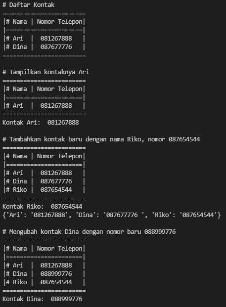
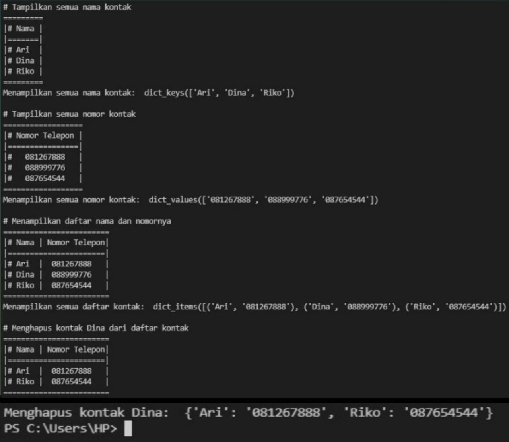
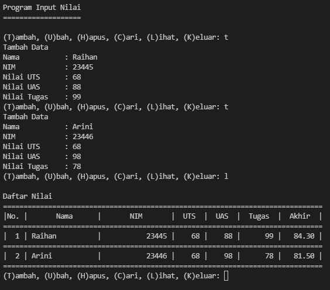

# Praktikum5
## Tugas Pertemuan 10 - Bahasa Pemrograman

### 1. File Latihan.py
Program ini adalah 

* **CODINGAN:**
```
 kontak = {'Ari': '081267888', 'Dina': '087677776 '}
 print("# Daftar Kontak")
 print("="*24)
 print("|# Nama | Nomor Telepon|")
 print("|"+"="*22+"|")
 print("|# Ari  |  081267888   |")
 print("|# Dina |  087677776   |")
 print("="*24+" \n")

 # Tampilkan kontaknya Ari
 print("# Tampilkan kontaknya Ari")
 print("="*24)
 print("|# Nama | Nomor Telepon|")
 print("|"+"="*22+"|")
 print("|# Ari  |  081267888   |")
 print("="*24)
 print('Kontak Ari: ', kontak['Ari']+' \n')

 # Tambahkan kontak baru dengan nama Riko, nomor 087654544
 print("# Tambahkan kontak baru dengan nama Riko, nomor 087654544")
 kontak['Riko'] = '087654544'
 print("="*24)
 print("|# Nama | Nomor Telepon|")
 print("|"+"="*22+"|")
 print("|# Ari  |  081267888   |")
 print("|# Dina |  087677776   |")
 print("|# Riko |  087654544   |")
 print("="*24)
 print('Kontak Riko: ', kontak['Riko'])
 print(kontak,' \n')

 # Ubah kontak Dina dengan nomor baru 088999776
 print("# Mengubah kontak Dina dengan nomor baru 088999776")
 kontak['Dina'] = '088999776'
 print("="*24)
 print("|# Nama | Nomor Telepon|")
 print("|"+"="*22+"|")
 print("|# Ari  |  081267888   |")
 print("|# Dina |  088999776   |")
 print("|# Riko |  087654544   |")
 print("="*24)
 print('Kontak Dina: ', kontak['Dina']+' \n')

 # Tampilkan semua nama
 print("# Tampilkan semua nama kontak")
 print("="*9)
 print("|# Nama |")
 print("|"+"="*7+"|")
 print("|# Ari  |")
 print("|# Dina |")
 print("|# Riko |")
 print("="*9)
 print('Menampilkan semua nama kontak: ', kontak.keys(), ' \n')

 # Tampilkan semua nomor
 print("# Tampilkan semua nomor kontak")
 print("="*18)
 print("|# Nomor Telepon |")
 print("|"+"="*16+"|")
 print("|#   081267888   |")
 print("|#   088999776   |")
 print("|#   087654544   |")
 print("="*18)
 print('Menampilkan semua nomor kontak: ', kontak.values(), ' \n')

 # Tampilkan daftar nama dan nomornya
 print('# Menampilkan daftar nama dan nomornya')
 print("="*24)
 print("|# Nama | Nomor Telepon|")
 print("|"+"="*22+"|")
 print("|# Ari  |  081267888   |")
 print("|# Dina |  088999776   |")
 print("|# Riko |  087654544   |")
 print("="*24)
 print('Menampilkan semua daftar kontak: ', kontak.items(), ' \n')

 # Hapus kontak Dina
 print('# Menghapus kontak Dina dari daftar kontak')
 print("="*24)
 print("|# Nama | Nomor Telepon|")
 print("|"+"="*22+"|")
 print("|# Ari  |  081267888   |")
 print("|# Riko |  087654544   |")
 print("="*24)
 del kontak['Dina'] 
 print('Menghapus kontak Dina: ', kontak)
```

* **Hasil output program:**






### 2. File Praktikum.py
Program ini adalah program sederhana yang akan menampilkan daftar nilai mahasiswa, Dengan program yang dibuat dengan menggunakan **Dictionary**
* **CODINGAN:**
```
   a = {}
 print("="*19)
 print("Program Input Nilai")
 print("="*19+" \n")

 while True:
     x = input("(T)ambah, (U)bah, (H)apus, (C)ari, (L)ihat, (K)eluar: ")

     if x.lower() == 't':
         print("Tambah Data")
         nama = input("Nama           : ")
         nim = int(input("NIM            : "))
         uts = int(input("Nilai UTS      : "))
         uas = int(input("Nilai UAS      : "))
         tugas = int(input("Nilai Tugas    : "))
         n_akhir = tugas * 0.30 + uts * 0.35 + uas * 0.35
         a[nama] = nim, uts, uas, tugas, n_akhir

     elif x.lower() == 'u':
         print("Ubah Data")
         nama = input("Masukkan Nama   : ")
         if nama in a.keys():
             nim = int(input("NIM            : "))
             uts = int(input("Nilai UTS      : "))
             uas = int(input("Nilai UAS      : "))
             tugas = int(input("Nilai Tugas    : "))
             n_akhir = tugas*0.30 + uts*0.35 + uas*0.35
             a[nama] = nim, uts, uas, tugas, n_akhir
         else:
             print("Nama{0} Tidak Ditemukan".format(nama))

     elif x.lower() == 'h':
         print("Hapus Data")
         nama = input("Masukkan Nama  : ")
         if nama in a.keys():
             del a[nama]
         else:
             print("Nama {0} Tidak Ditemukan".format(nama))

     elif x.lower() == 'c':
         print("Cari Data")
         nama = input("Masukkan Nama : ")
         if nama in a.keys():
            
             print("\nDaftar Nilai")
             print("=" * 73)
             print("|       Nama        |       NIM       |  UTS   |  UAS  |  Tugas  |  Akhir  |")
             print("=" * 73)
             print("| {0:15s} | {1:15d} | {2:5d} | {3:5d} | {4:7d} | {5:7.2f} |"
                   .format(nama, nim, uts, uas, tugas, n_akhir))
             print("=" * 73)
         else:
             print("Nama {0} Tidak Ditemukan".format(nama))

     elif x.lower() == 'l':
         if a.items():
             print("\nDaftar Nilai")
             print("=" * 78)
             print("|No. |       Nama      |       NIM       |  UTS  |  UAS  |  Tugas  |  Akhir  |")
             print("=" * 78)
             i = 0
             for y in a.items():
                 i += 1
                 print("| {no:2d} | {0:15s} | {1:15d} | {2:5d} | {3:5d} | {4:7d} | {5:7.2f} |"
                       .format(y[0][:13], y[1][0], y[1][1], y[1][2], y[1][3], y[1][4], no=i))
                 print("=" * 78)
         else:
             print("\nDaftar Nilai")
             print("=" * 78)
             print("|No. |       Nama      |       NIM       |  UTS  |  UAS  |  Tugas  |  Akhir  |")
             print("=" * 78)
             print("|                                TIDAK ADA DATA                              |")
             print("=" * 78)

     elif x.lower() == 'k':
         break

     else:
         print("Pilih Menu Yang Tersedia")
```

* **Hasil output program:**

Ouput program menambahkan data, dengan memasukkan keyword "t".



* **Flowchart:**


* **Penjelasan program:**

